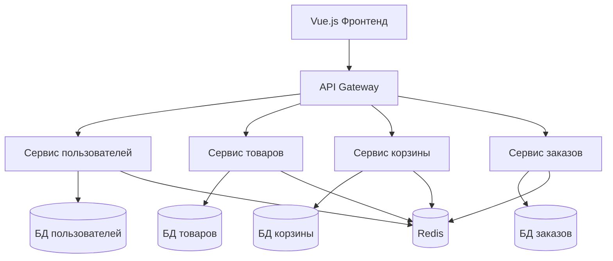

# 🛒 MicroShop - Современная E-commerce платформа на микросервисах

Комплексная платформа электронной коммерции, построенная на микросервисах **Django REST Framework** и фронтенде **Vue.js 3**, демонстрирующая современные паттерны архитектуры программного обеспечения и лучшие практики.

## ✨ Возможности

- **🔐 Аутентификация и управление пользователями** - JWT авторизация с профилями пользователей
- **📦 Каталог товаров** - Расширенный просмотр товаров с категориями и поиском
- **🛒 Корзина покупок** - Управление корзиной в реальном времени между сервисами
- **📋 Обработка заказов** - Полный жизненный цикл заказа с отслеживанием статуса
- **🌐 API Gateway** - Централизованная маршрутизация с ограничением скорости
- **⚡ События в реальном времени** - Redis pub/sub для связи между сервисами
- **📱 Отзывчивый интерфейс** - Современный Vue.js фронтенд с Tailwind CSS

## 🏗️ Архитектура



## 🚀 Быстрый старт

### Требования
- Python 3.9+
- Node.js 16+
- Redis сервер

### 1. Клонирование и настройка
```bash
git clone <url-репозитория>
cd microshop
```

### 2. Запуск сервисов
```bash
# Терминал 1 - Сервис пользователей
cd services/user-service
pip install -r requirements.txt
python manage.py migrate
python manage.py runserver 0.0.0.0:8004

# Терминал 2 - Сервис товаров
cd services/product-service
pip install -r requirements.txt
python manage.py migrate
python manage.py loaddata fixtures/products.json
python manage.py runserver 0.0.0.0:8001

# Терминал 3 - Сервис корзины
cd services/cart-service
pip install -r requirements.txt
python manage.py migrate
python manage.py runserver 0.0.0.0:8002

# Терминал 4 - Сервис заказов
cd services/order-service
pip install -r requirements.txt
python manage.py migrate
python manage.py runserver 0.0.0.0:8003

# Терминал 5 - API Gateway
cd api-gateway
pip install -r requirements.txt
python manage.py migrate
python manage.py runserver 0.0.0.0:8000

# Терминал 6 - Фронтенд
cd frontend
npm install
npm run dev
```

### 3. Доступ к приложению
- **Фронтенд**: http://localhost:3000
- **API Gateway**: http://localhost:8000
- **Сервисы**: 8001 (Товары), 8002 (Корзина), 8003 (Заказы), 8004 (Пользователи)

## 📁 Структура проекта

```
microshop/
├── 🌐 frontend/                 # Vue.js 3 + Tailwind CSS
│   ├── src/components/          # Переиспользуемые UI компоненты
│   ├── src/views/              # Компоненты страниц
│   ├── src/store/              # Управление состоянием Pinia
│   └── src/services/           # API сервисы
├── 🚪 api-gateway/             # Django API Gateway
│   └── apps/gateway/           # Маршрутизация запросов и ограничение скорости
├── 🏢 services/
│   ├── 👤 user-service/        # Аутентификация и профили
│   ├── 📦 product-service/     # Каталог товаров и инвентарь
│   ├── 🛒 cart-service/        # Управление корзиной покупок
│   └── 📋 order-service/       # Обработка и отслеживание заказов
└── 📊 databases/               # SQLite базы данных
```

## 🛠️ Технологический стек

### Backend
- **Фреймворк**: Django REST Framework
- **Аутентификация**: JWT (Simple JWT)
- **База данных**: SQLite (легко заменяется)
- **Кэш и события**: Redis
- **Архитектура**: Микросервисы

### Frontend
- **Фреймворк**: Vue.js 3 (Composition API)
- **Состояние**: Pinia
- **Стили**: Tailwind CSS
- **HTTP клиент**: Axios
- **Маршрутизация**: Vue Router

## 📋 API эндпоинты

### Сервис пользователей (8004)
```
POST   /api/users/register/     # Регистрация пользователя
POST   /api/auth/login/         # Вход пользователя
GET    /api/users/profile/      # Получить профиль пользователя
```

### Сервис товаров (8001)
```
GET    /api/products/           # Список товаров
GET    /api/products/{id}/      # Детали товара
GET    /api/categories/         # Список категорий
```

### Сервис корзины (8002)
```
GET    /api/cart/               # Получить корзину пользователя
POST   /api/cart/add/           # Добавить в корзину
PUT    /api/cart/update/{id}/   # Обновить элемент корзины
```

### Сервис заказов (8003)
```
GET    /api/orders/             # Список заказов пользователя
POST   /api/orders/create/      # Создать заказ
GET    /api/orders/{id}/        # Детали заказа
```

## 🔄 Событийно-ориентированная архитектура

Сервисы взаимодействуют через Redis pub/sub для слабосвязанных обновлений в реальном времени:

- `order.created` → Очистить корзину пользователя
- `order.cancelled` → Восстановить товарный запас
- `product.updated` → Инвалидировать кэши

## 🧪 Тестирование

Каждый сервис включает административные интерфейсы и проверки здоровья:
- **Админ-панель**: `http://localhost:800X/admin/`
- **Проверка здоровья**: `http://localhost:800X/health/`

## 🔧 Настройка для разработки

### Создание суперпользователя для каждого сервиса
```bash
# В каждом сервисе выполните:
python manage.py createsuperuser
```

### Загрузка тестовых данных
```bash
# Только для сервиса товаров
cd services/product-service
python manage.py loaddata fixtures/products.json
```

### Запуск Redis (если не установлен)
```bash
# Ubuntu/Debian
sudo apt-get install redis-server
sudo systemctl start redis

# macOS
brew install redis
brew services start redis

# Windows
# Скачайте и установите Redis с официального сайта
```

## 📚 Дополнительная информация

### Порты сервисов
- **3000**: Vue.js фронтенд
- **8000**: API Gateway
- **8001**: Product Service
- **8002**: Cart Service
- **8003**: Order Service
- **8004**: User Service

## 🐛 Устранение неполадок

### Проблема: Порт уже занят
```bash
# Найти и завершить процесс на порту
lsof -ti:8000 | xargs kill -9
```

### Проблема: Redis не запускается
```bash
# Проверить статус Redis
redis-cli ping
# Должен вернуть PONG
```
